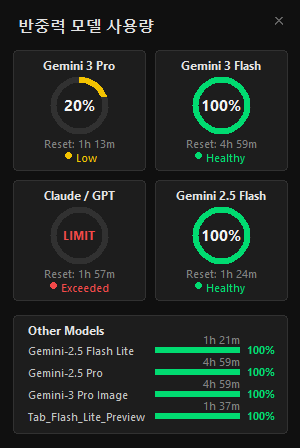

# Antigravity Quota Widget



A compact, always-on-top desktop widget for monitoring Google Cloud Code (Antigravity) AI model quotas.

---

### Languages / 언어 / 言語 / 语言 / Idiomas / Sprachen
[English](#english) | [한국어 (Korean)](#korean) | [日本語 (Japanese)](#japanese) | [简体中文 (Simplified Chinese)](#simplified-chinese) | [Español (Spanish)](#spanish) | [Deutsch (German)](#german) | [Français (French)](#french)

---

## English

### Features
- **Real-time Quota Monitoring**: Tracks usage for Gemini 3 Pro, Flash, Claude Opus 4.6, GPT, and more.
- **Compact UI**: Minimalist 300px wide window that stays on top of other applications.
- **Status Indicators**: Visual cues for Healthy (Green), Low (Yellow), and Exceeded (Red) states.
- **Intelligent Grouping**: Automatically groups related models (e.g., Gemini 3 Pro High/Low).
- **Localization**: Auto-detects system language (Korean/English title).

### Installation & Usage

#### Running from Source
1. Clone the repository:
   ```bash
   git clone https://github.com/BK-Dan/AntigravityQuotaWidget.git
   cd AntigravityQuotaWidget
   ```
2. Create and activate a virtual environment:
   ```bash
   python -m venv .venv
   .\.venv\Scripts\activate
   ```
3. Install dependencies:
   ```bash
   pip install -r requirements.txt
   ```
4. Run the widget:
   ```bash
   python ag_widget.py
   ```

#### Building Your Own Executable
If you prefer a standalone `.exe` file, you can build it yourself using `pyinstaller`.

1. Install PyInstaller:
   ```bash
   pip install pyinstaller
   ```
2. Build the executable:
   ```bash
   pyinstaller --onefile --noconsole --name "AntigravityQuota" ag_widget.py
   ```
3. The generated `AntigravityQuota.exe` will be located in the `dist/` folder.

### Usage Tips
> [!IMPORTANT]
> **This widget relies on the Cloud Code API server running locally on your IDE.**  
> Please ensure one of the following is running for the widget to fetch data correctly:
> - **VS Code** (Stable / Insiders) with Cloud Code extension
> - **Antigravity**
> - **Cursor**, **Windsurf**, or **VSCodium** with Cloud Code extension
> - If the widget shows "Login Required" or fails to update, check if your IDE is active.
> - You can create a desktop shortcut (e.g., `Antigravity.lnk`) to launch them together for convenience.

---

## <a id="korean"></a>한국어 (Korean)

### 주요 기능
- **실시간 쿼터 모니터링**: Gemini 3 Pro, Flash, Claude Opus 4.6, GPT 등의 AI 모델 사용량을 추적합니다.
- **컴팩트 UI**: 항상 위에 표시되는(Always-on-top) 미니멀한 300px 너비의 위젯입니다.
- **상태 표시**: 사용량 상태를 색상으로 직관적으로 표시합니다 (Healthy-초록, Low-노랑, Exceeded-빨강).
- **지능형 그룹화**: 관련 모델을 자동으로 그룹화하여 보여줍니다 (예: Gemini 3 Pro High/Low 통합).
- **언어 감지**: 시스템 언어를 감지하여 타이틀을 한국어/영어로 자동 변경합니다.

### 설치 및 사용법

#### 소스 코드로 실행하기
1. 저장소 복제:
   ```bash
   git clone https://github.com/BK-Dan/AntigravityQuotaWidget.git
   cd AntigravityQuotaWidget
   ```
2. 가상 환경 생성 및 활성화:
   ```bash
   python -m venv .venv
   .\.venv\Scripts\activate
   ```
3. 의존성 패키지 설치:
   ```bash
   pip install -r requirements.txt
   ```
4. 위젯 실행:
   ```bash
   python ag_widget.py
   ```

#### 실행 파일 직접 빌드하기
단독 실행 파일(`.exe`)이 필요한 경우, `pyinstaller`를 사용하여 직접 빌드할 수 있습니다.

1. PyInstaller 설치:
   ```bash
   pip install pyinstaller
   ```
2. 실행 파일 빌드:
   ```bash
   pyinstaller --onefile --noconsole --name "AntigravityQuota" ag_widget.py
   ```
3. 생성된 `AntigravityQuota.exe` 파일은 `dist/` 폴더에 위치합니다.

### 사용 팁
> [!IMPORTANT]
> **이 위젯은 IDE에서 실행 중인 로컬 Cloud Code API 서버에 의존합니다.**  
> 위젯이 데이터를 정상적으로 가져오려면 **VS Code** (Cloud Code 확장 설치됨) 또는 **Antigravity**가 실행 중이어야 합니다.
> - 위젯에 "로그인 필요"가 표시되거나 업데이트되지 않는 경우, IDE가 켜져 있는지 확인하세요.
> - 편의를 위해 `Antigravity.lnk`와 같은 바로가기를 만들어 함께 실행하는 것을 권장합니다.

---

## <a id="japanese"></a>日本語 (Japanese)

### 主な機能
- **リアルタイムクォータ監視**: Gemini 3 Pro、Flash、Claude Opus 4.6、GPTなどのAIモデルの使用量を追跡します。
- **コンパクトUI**: 常に手前に表示される(Always-on-top)ミニマルな300px幅のウィジェットです。
- **ステータス表示**: 使用状況を色で直感的に表示します (Healthy-緑, Low-黄, Exceeded-赤)。
- **インテリジェントなグループ化**: 関連モデルを自動的にグループ化して表示します。
- **言語検出**: システム言語を検出し、タイトルを自動的に変更します。

### インストールと使用方法

#### ソースコードから実行
1. リポジトリのクローン:
   ```bash
   git clone https://github.com/BK-Dan/AntigravityQuotaWidget.git
   cd AntigravityQuotaWidget
   ```
2. 仮想環境の作成と有効化:
   ```bash
   python -m venv .venv
   .\.venv\Scripts\activate
   ```
3. 依存関係のインストール:
   ```bash
   pip install -r requirements.txt
   ```
4. ウィジェットの実行:
   ```bash
   python ag_widget.py
   ```

#### 実行ファイルのビルド
スタンドアロンの実行ファイル(`.exe`)が必要な場合は、自分でビルドできます。

1. PyInstallerのインストール:
   ```bash
   pip install pyinstaller
   ```
2. ビルドの実行:
   ```bash
   pyinstaller --onefile --noconsole --name "AntigravityQuota" ag_widget.py
   ```
3. 生成された `AntigravityQuota.exe` は `dist/` フォルダに保存されます。

### 使用上のヒント
> [!IMPORTANT]
> **このウィジェットは、IDE上で実行されているローカルCloud Code APIサーバーに依存しています。**  
> データを正しく取得するには、**VS Code** (Cloud Code拡張機能がインストールされていること) または **Antigravity** が実行されている必要があります。
> - 「ログインが必要」と表示される場合は、IDEが起動しているか確認してください。

---

## <a id="simplified-chinese"></a>简体中文 (Simplified Chinese)

### 主要功能
- **实时配额监控**: 追踪 Gemini 3 Pro, Flash, Claude Opus 4.6, GPT 等 AI 模型的使用量。
- **紧凑的用户界面**: 简约的 300px 宽窗口，始终保持在最前端。
- **状态指示器**: 直观的颜色状态显示 (Healthy-绿, Low-黄, Exceeded-紅)。
- **智能分组**: 自动分组相关模型。
- **本地化**: 自动检测系统语言并更改标题。

### 安装与使用

#### 从源代码运行
1. 克隆仓库:
   ```bash
   git clone https://github.com/BK-Dan/AntigravityQuotaWidget.git
   cd AntigravityQuotaWidget
   ```
2. 创建并激活虚拟环境:
   ```bash
   python -m venv .venv
   .\.venv\Scripts\activate
   ```
3. 安装依赖:
   ```bash
   pip install -r requirements.txt
   ```
4. 运行小组件:
   ```bash
   python ag_widget.py
   ```

#### 构建可执行文件
如果您需要独立的可执行文件 (`.exe`)，可以使用 `pyinstaller`自行构建。

1. 安装 PyInstaller:
   ```bash
   pip install pyinstaller
   ```
2. 构建可执行文件:
   ```bash
   pyinstaller --onefile --noconsole --name "AntigravityQuota" ag_widget.py
   ```
3. 生成的 `AntigravityQuota.exe` 文件将位于 `dist/` 文件夹中。

### 使用提示
> [!IMPORTANT]
> **此小组件依赖于 IDE 上运行的本地 Cloud Code API 服务器。**  
> 请确保 **VS Code** (已安装 Cloud Code 扩展) 或 **Antigravity** 正在运行，以便正确获取数据。

---

## <a id="spanish"></a>Español (Spanish)

### Características
- **Monitoreo de Cuotas en Tiempo Real**: Rastrea el uso de Gemini 3 Pro, Flash, Claude Opus 4.6, GPT, etc.
- **Interfaz Compacta**: Ventana minimalista de 300px de ancho que siempre permanece visible.
- **Indicadores de Estado**: Señales visuales para estados Saludable (Verde), Bajo (Amarillo) y Excedido (Rojo).
- **Agrupación Inteligente**: Agrupa automáticamente modelos relacionados.

### Instalación y Uso

#### Ejecutar desde el Código Fuente
1. Clonar el repositorio:
   ```bash
   git clone https://github.com/BK-Dan/AntigravityQuotaWidget.git
   cd AntigravityQuotaWidget
   ```
2. Crear y activar entorno virtual:
   ```bash
   python -m venv .venv
   .\.venv\Scripts\activate
   ```
3. Instalar dependencias:
   ```bash
   pip install -r requirements.txt
   ```
4. Ejecutar el widget:
   ```bash
   python ag_widget.py
   ```

#### Construir tu propio Ejecutable
1. Instalar PyInstaller:
   ```bash
   pip install pyinstaller
   ```
2. Construir el ejecutable:
   ```bash
   pyinstaller --onefile --noconsole --name "AntigravityQuota" ag_widget.py
   ```
3. El archivo `AntigravityQuota.exe` se generará en la carpeta `dist/`.

### Consejos de Uso
> [!IMPORTANT]
> **Este widget depende del servidor API de Cloud Code que se ejecuta localmente en su IDE.**  
> Asegúrese de que **VS Code** (con la extensión Cloud Code) o **Antigravity** esté ejecutándose.

---

## <a id="german"></a>Deutsch (German)

### Funktionen
- **Echtzeit-Quotenüberwachung**: Verfolgt die Nutzung von Gemini 3 Pro, Flash, Claude Opus 4.6, GPT usw.
- **Kompakte Benutzeroberfläche**: Minimalistisches 300px breites Fenster, das immer im Vordergrund bleibt.
- **Statusanzeigen**: Visuelle Hinweise für die Zustände Gesund (Grün), Niedrig (Gelb) und Überschritten (Rot).
- **Intelligente Gruppierung**: Gruppiert verwandte Modelle automatisch.

### Installation & Nutzung

#### Aus dem Quellcode ausführen
1. Repository klonen:
   ```bash
   git clone https://github.com/BK-Dan/AntigravityQuotaWidget.git
   cd AntigravityQuotaWidget
   ```
2. Virtuelle Umgebung erstellen und aktivieren:
   ```bash
   python -m venv .venv
   .\.venv\Scripts\activate
   ```
3. Abhängigkeiten installieren:
   ```bash
   pip install -r requirements.txt
   ```
4. Widget ausführen:
   ```bash
   python ag_widget.py
   ```

#### Eigene ausführbare Datei erstellen
1. PyInstaller installieren:
   ```bash
   pip install pyinstaller
   ```
2. Ausführbare Datei erstellen:
   ```bash
   pyinstaller --onefile --noconsole --name "AntigravityQuota" ag_widget.py
   ```
3. Die Datei `AntigravityQuota.exe` befindet sich im Ordner `dist/`.

### Nutzungstipps
> [!IMPORTANT]
> **Dieses Widget basiert auf dem Cloud Code API-Server, der lokal auf Ihrer IDE ausgeführt wird.**  
> Bitte stellen Sie sicher, dass **VS Code** (mit installierter Cloud Code-Erweiterung) oder **Antigravity** ausgeführt wird.

---

## <a id="french"></a>Français (French)

### Fonctionnalités
- **Suivi des Quotas en Temps Réel**: Suit l'utilisation de Gemini 3 Pro, Flash, Claude Opus 4.6, GPT, etc.
- **Interface Compacte**: Fenêtre minimaliste de 300px de large qui reste toujours au-dessus.
- **Indicateurs d'État**: Indices visuels pour les états Sain (Vert), Faible (Jaune) et Dépassé (Rouge).
- **Regroupement Intelligent**: Regroupe automatiquement les modèles associés.

### Installation et Utilisation

#### Exécuter depuis le Code Source
1. Cloner le dépôt:
   ```bash
   git clone https://github.com/BK-Dan/AntigravityQuotaWidget.git
   cd AntigravityQuotaWidget
   ```
2. Créer et activer un environnement virtuel:
   ```bash
   python -m venv .venv
   .\.venv\Scripts\activate
   ```
3. Installer les dépendances:
   ```bash
   pip install -r requirements.txt
   ```
4. Lancer le widget:
   ```bash
   python ag_widget.py
   ```

#### Construire votre propre exécutable
1. Installer PyInstaller:
   ```bash
   pip install pyinstaller
   ```
2. Construire l'exécutable:
   ```bash
   pyinstaller --onefile --noconsole --name "AntigravityQuota" ag_widget.py
   ```
3. Le fichier `AntigravityQuota.exe` sera situé dans le dossier `dist/`.

### Conseils d'Utilisation
> [!IMPORTANT]
> **Ce widget dépend du serveur API Cloud Code exécuté localement sur votre IDE.**  
> Veuillez vous assurer que **VS Code** (avec l'extension Cloud Code installée) ou **Antigravity** est en cours d'exécution.

---

## License

MIT License
